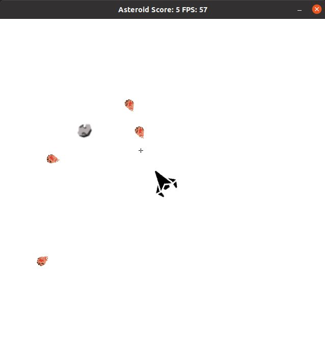
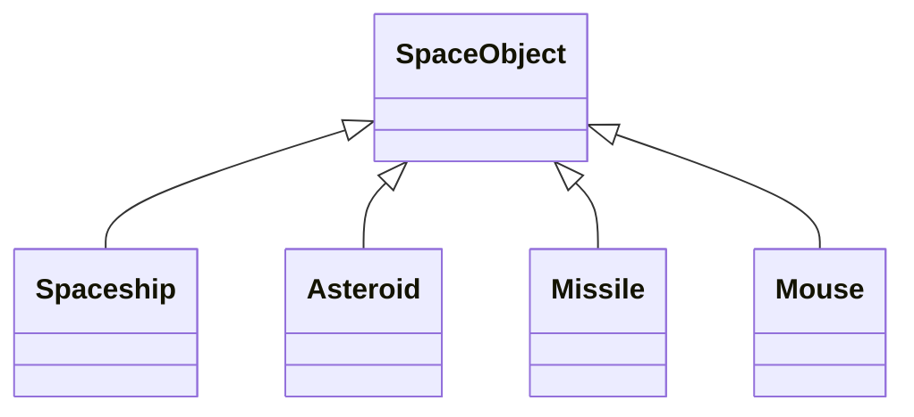

# CPPND: Capstone Asteroid Game
This Project is based on a fork of the Capstone Snake Game, the game structure and some component are recycled in this new
game. This version fo the asteroid is simple and let you shoot asteroid while the score is incremented at each destroyed 
asteroid. You simply have to click left in the direction of the asteroid. The aim cross indicate the shooting direction.

Here is an image as an example of the game design.

## File and Class structure
All source code and header files are contained inside the /src repository.

All image for the game design are in the root directory.

The following diagram shows the class hierarchy between the space objects, they all inherit from SpaceObject Abstract Class 
one of the function ("update") is a pure virtual function and need to be implemented inside the child classes.

## Rubric Point addressed

- ***Loops, Functions, I/O***
  - **The project demonstrates an understanding of C++ functions and control structures** : Can be found across all part of 
  the source code
  - **The project accepts user input and processes the input** : *controller.cpp:11*
- ***OOP***
  - **The project uses Object Oriented Programming techniques** : Can be found across all part of the source code
  - **Classes use appropriate access specifiers for class members** : Present in all header files
  - **Class constructors utilize member initialization lists** : Constructor of SpaceObject, Missile, Asteroid, Renderer,
    Game
  - **Classes encapsulate behavior** :  Present in all classes files
  - **Classes follow an appropriate inheritance hierarchy** : Classe hierarchy with SpaceObject referenced in the above 
    diagram
  - **Overloaded functions allow the same function to operate on different parameters** : *SpaceObject.cpp:20*
  - **Derived class functions override virtual base class functions** : Missile and Asteroid classes
  - **Templates generalize functions in the project** : *game.cpp:158*
- ***Memory management***
  - **The project makes use of references in function declarations** : *controller.h* and *renderer.h*
- ***Concurency***
  - **The project uses multithreading** : *game.cpp:23*
  - **A mutex or lock is used in the project** : *game.cpp:30* Render function and *game.cpp:80* Update function
## Dependencies for Running Locally
* cmake >= 3.7
  * All OSes: [click here for installation instructions](https://cmake.org/install/)
* make >= 4.1 (Linux, Mac), 3.81 (Windows)
  * Linux: make is installed by default on most Linux distros
  * Mac: [install Xcode command line tools to get make](https://developer.apple.com/xcode/features/)
  * Windows: [Click here for installation instructions](http://gnuwin32.sourceforge.net/packages/make.htm)
* SDL2 >= 2.0
  * All installation instructions can be found [here](https://wiki.libsdl.org/Installation)
  >Note that for Linux, an `apt` or `apt-get` installation is preferred to building from source. 
* gcc/g++ >= 5.4
  * Linux: gcc / g++ is installed by default on most Linux distros
  * Mac: same deal as make - [install Xcode command line tools](https://developer.apple.com/xcode/features/)
  * Windows: recommend using [MinGW](http://www.mingw.org/)

## Basic Build Instructions

1. Clone this repo.
2. Make a build directory in the top level directory: `mkdir build && cd build`
3. Compile: `cmake .. && make`
4. Run it: `./Asteroid`.

## CC Attribution-ShareAlike 4.0 International

Shield: [![CC BY-SA 4.0][cc-by-sa-shield]][cc-by-sa]

This work is licensed under a
[Creative Commons Attribution-ShareAlike 4.0 International License][cc-by-sa].

[![CC BY-SA 4.0][cc-by-sa-image]][cc-by-sa]

[cc-by-sa]: http://creativecommons.org/licenses/by-sa/4.0/
[cc-by-sa-image]: https://licensebuttons.net/l/by-sa/4.0/88x31.png
[cc-by-sa-shield]: https://img.shields.io/badge/License-CC%20BY--SA%204.0-lightgrey.svg
